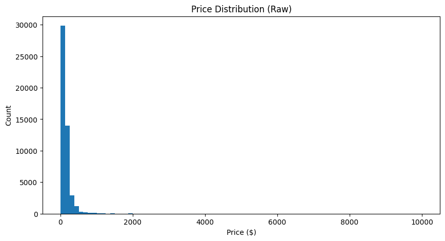
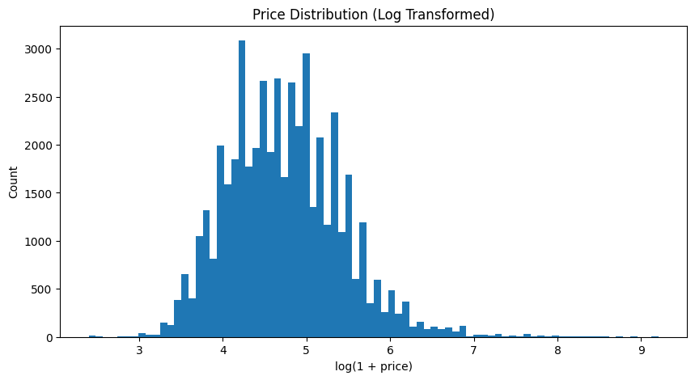
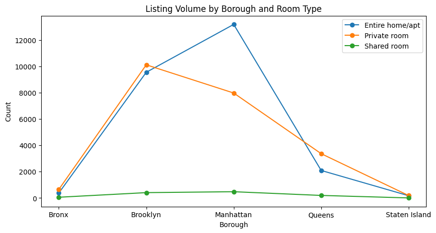
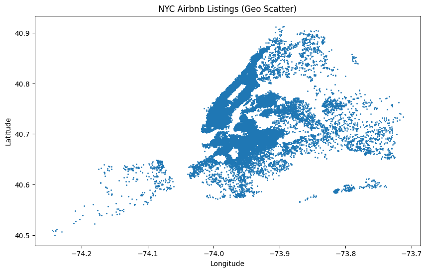
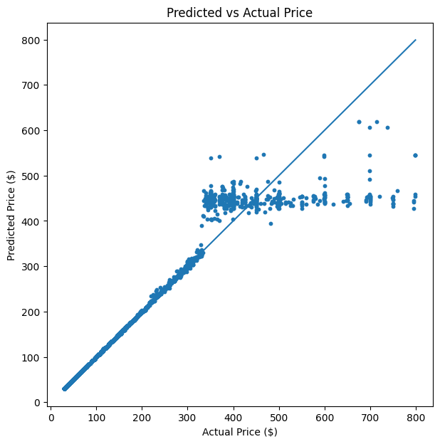

# NYC Airbnb Market Analysis

## Project Overview
This project analyzes **New York City Airbnb listings (2019)** to uncover pricing patterns, room-type differences, and borough-level market concentration. In addition to exploratory analysis, the project includes a **baseline price prediction model** built using a reproducible scikit-learn pipeline.

---

## Dataset
**NYC Airbnb Open Data (2019) — Kaggle**  
Dataset link:  
https://www.kaggle.com/datasets/dgomonov/new-york-city-airbnb-open-data

The dataset contains ~48,895 listings with details such as:
- Borough and neighborhood
- Location coordinates (latitude/longitude)
- Room type
- Price
- Minimum nights
- Review activity
- Availability across the year

Target variable used for modeling: **Price** (modeled as `log(1 + price)`)

---

## Objectives
- Explore pricing trends across NYC boroughs and neighborhoods  
- Compare listing distribution by **borough + room type**  
- Identify price skew and handle outliers for stable analysis  
- Build and evaluate a **baseline regression model** to estimate Airbnb prices  
- Interpret results in a business-focused way

---

## Tools and Technologies
- Python  
- pandas, NumPy  
- matplotlib  
- scikit-learn  

---

## Methodology

### 1) Data Preparation
- Removed duplicate rows
- Converted date fields (`last_review`) to datetime
- Filtered invalid prices (`price > 0`)
- Applied **log transformation** to reduce price skew
- Applied **outlier handling** using percentile filtering / IQR clipping for more stable visuals and modeling

### 2) Exploratory Data Analysis (EDA)
- Price distribution (raw vs log scale)
- Borough-level listing concentration
- Room type comparison across boroughs
- Minimum nights and availability patterns
- NYC geographic scatter map (longitude vs latitude)

### 3) Modeling (Price Prediction)
To predict listing price more reliably, the model was trained on **log-transformed price**:

- Preprocessing pipeline:
  - Numeric: median imputation
  - Categorical: most-frequent imputation + one-hot encoding
- Models compared:
  - Ridge Regression (baseline linear model)
  - Random Forest Regressor
  - Gradient Boosting Regressor

### 4) Evaluation
- RMSE (log scale)
- MAE (log scale)
- R² score
- Final model evaluated again on real price scale by reversing log transform

---

## Model Performance Summary

### Model Comparison (Test Set)
| Model | RMSE (log) | MAE (log) | R² |
|------|------------:|----------:|---:|
| RandomForest | 0.050337 | 0.009567 | 0.993756 |
| GradientBoosting | 0.050721 | 0.011904 | 0.993660 |
| Ridge | 0.637177 | 0.522244 | -0.000545 |

Tree-based models performed extremely well, while the linear baseline (Ridge) failed to capture the pricing structure, suggesting strong **non-linear patterns and feature interactions**.

---

## Final Model Selection
**Final Model:** Gradient Boosting Regressor  
**R² (log-price):** 0.9937

Final evaluation (converted back to price scale):
- **RMSE (price): 25.33**
- **MAE (price): 4.94**
- **R² (log-price): 0.9937**

This indicates strong predictive accuracy and stable generalization for a baseline pricing estimator.

---

## Key Insights (EDA Findings)
- **Manhattan and Brooklyn dominate Airbnb supply**, showing heavy market concentration in two boroughs.
- Prices are **right-skewed**, meaning most listings are affordable, but a small number of premium listings create a long tail.
- **Entire home/apartment** listings are consistently higher priced than private/shared rooms.
- Minimum-night requirements vary widely and reflect different hosting strategies (short-stay vs long-stay targeting).
- Listing locations cluster clearly across borough boundaries when plotted using longitude/latitude.

---

## Business Recommendations / Applications
This analysis can support decision-making for multiple stakeholders:

### Hosts
- Benchmark pricing based on borough and room type
- Identify competitive pricing bands in high-density areas
- Adjust minimum-night strategy based on similar listings

### Investors
- Compare borough-level inventory and pricing trends
- Spot high-demand areas with high listing activity and pricing stability

### Market Analysts / Operations
- Understand supply concentration across NYC
- Segment inventory by room type and pricing tiers
- Use baseline model predictions as a starting point for pricing tools

---

## Charts Preview

### Price Distribution (Raw)

### Price Distribution (Log Transformed)

### Listing Volume by Borough and Room Type

### NYC Listings Geo Scatter Map

### Predicted vs Actual Price (Final Model)

